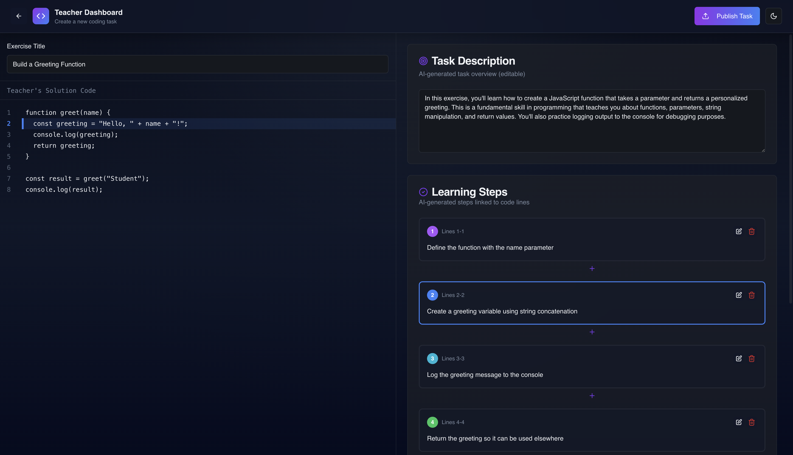
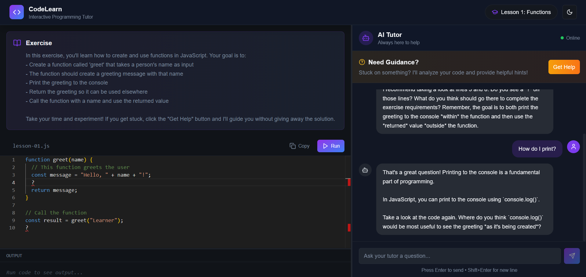
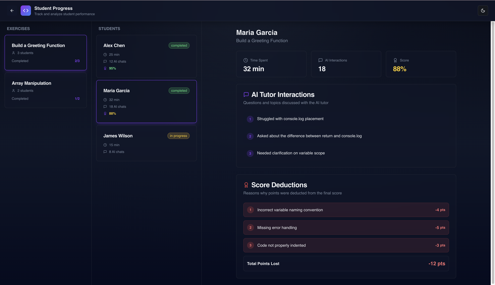
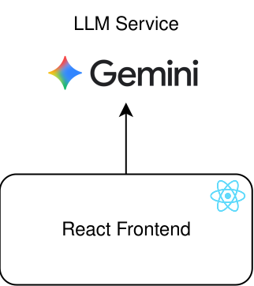
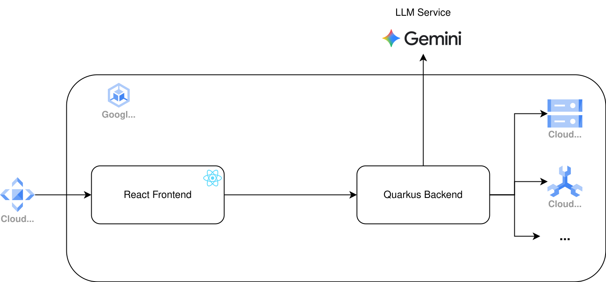

# Codor

### Intelligent Programming Education Platform

  
    Hagenberger Fünfeck @ GDG
  
  
    Track C: Next-Gen Education
  
  
    Members: Daxerer Christoph, Karer Lukas, Jung Simon, Habermaeir Florentin, Callec Matéo
  

---
layout: default
glowSeed: 18
---

# Programming Exercises in Education

<v-click>

  
01

  

    <h3 class="text-2xl font-bold mb-1 text-green-700 opacity-100!">Exercise Creation</h3>
    
Creating quality programming exercises requires significant time investment for teachers.

  

</v-click>

<v-click>

  
02

  

    <h3 class="text-2xl font-bold mb-3 text-green-700 opacity-100!">Individual Support</h3>
    
Supporting students 1 on 1 at home is basically impossible.

  

</v-click>

<v-click>

  
03

  

    <h3 class="text-2xl font-bold mb-3 text-green-700 opacity-100!">Visibility Gap</h3>
    
What are students struggling with at home?

  

</v-click>

<v-click>

  
04

  

    <h3 class="text-2xl font-bold mb-3 text-green-700 opacity-100!">Assessment Scale</h3>
    
Grading at scale takes a lot of time.

  

</v-click>

<!-- 
1. Creating quality programming exercises requires significant time investment for teachers. Many resort to reusing old exercises or finding them online, which may not align with current teaching goals.
2. Providing individualized support to students working on programming exercises at home is nearly impossible. Teachers cannot be available to assist each student when they encounter difficulties.
3. Students working at home is a blackbox for the teacher. Students already don't like admitting that they struggled and doing so in the next lesson is already one lesson too late to prepare for the teacher. 
4. Grading programming exercises at scale is time-consuming. Automated grading systems often lack the nuance to assess code quality and problem-solving approaches effectively.
-->

---

# Introducing Codor

An intelligent platform that transforms how programming exercises are created, assigned, and completed

<v-clicks>

### For Educators
Upload solution code and generate structured exercises automatically

### For Students
Receive contextual guidance without direct solutions

</v-clicks>

---

# Creating an Assignment

  

---

# Intelligent Guidance System

  

---

# Analytics Dashboard

  

---

# Architecture

### Current PoC

  

Simple stack, everything is in the frontend, POC life 🤟

### Production System

  

Scalable Architecture:
- Microservices backend
- Kubernetes deployment
- Cloud CDN for frontend
- Sandboxed code execution
- SSO integration
- ...

---
layout: center
class: text-center
glowSeed: 225
---

# Codor

Enhancing teaching effectiveness 
Enabling independent learning

  

    Transforming Programming Education
  

GDG DevFest Submission 2025

